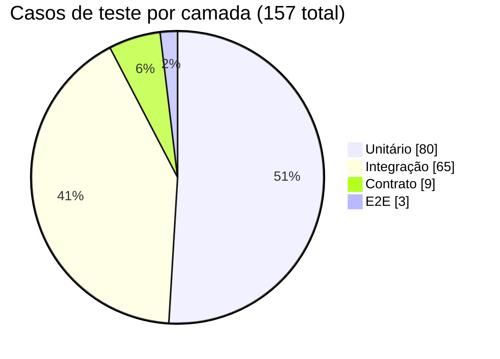

# Documentação de Testes — Planejador de Dieta

> Estratégia, plano e casos de teste do backend (unitário, integração, contrato — Jest/Supertest) e E2E (Playwright), com rastreabilidade até as regras de negócio.

---

## 1. Estratégia de Testes

### 1.1 Objetivos

- Garantir que as 5 regras de negócio centrais do gerador de cardápio (RN1–RN5) estão corretas e permanecem corretas a cada mudança (rede de segurança de regressão).
- Garantir que a API REST expõe essas regras de forma consistente, segura (autenticação/isolamento por usuário) e com contratos de resposta estáveis para o frontend.
- Garantir que os fluxos de maior risco para o produto funcionam de ponta a ponta na UI real, não apenas na camada de API.
- Detectar rupturas de contrato entre backend e frontend antes que cheguem à produção.

### 1.2 Escopo

**Dentro do escopo:**
- Camada de validação de entrada .
- API REST completa: `/auth`, `/receitas`, `/preferencias`, `/cardapio`.
- Autenticação JWT e isolamento de dados entre usuários (multiusuário).
- Contrato de resposta de cada endpoint (schema, tipos, campos obrigatórios).
- Fluxos de UI de maior risco: geração automática com restrição + meta calórica, não repetição em dias consecutivos, edição manual persistente.

**Fora do escopo (não coberto por esta suíte):**
- Testes de carga/performance sob concorrência real (múltiplos usuários simultâneos).
- Testes de acessibilidade (a11y) e cross-browser além do Chromium usado pelo Playwright.
- Testes de segurança ofensivos (pentest, fuzzing de payloads maliciosos além de validação de schema).
- Fluxo E2E completo ponta a ponta (login → cadastro de receitas → preferências → geração → edição → visão mensal) — deliberadamente reduzido aos 3 cenários de maior risco/valor (ver seção 1.3 e §7).

### 1.3 Técnicas aplicadas por camada

| Camada | Técnica principal | Como é aplicada aqui |
|---|---|---|
| Unitário | Cobertura de sentença e decisão | `geradorCardapio.js` e `validators.js` têm threshold de 90% (statements/branches/functions/lines) configurado em `backend/jest.config.js`; todo `if`/ramo de decisão do algoritmo e dos validadores tem um teste dedicado a cada lado da decisão. |
| Unitário | Particionamento de equivalência + Análise de Valor Limite (AVL) | Aplicado sistematicamente em `validators.test.js` (ex.: `calorias = -1` inválido / `0` válido; `senha` com 7 vs. 8 caracteres; `meta_calorica` com `0` vs. `1`). |
| Integração | Heurística **VADER** (Verbs, Authorization, Data, Errors, Responsiveness) | Ver detalhamento em §5. |
| Integração | Regras de negócio pela camada de API | Cada RN1–RN5 tem pelo menos um teste de integração equivalente ao teste unitário, provando que a regra sobrevive à composição rota→repositório→SQLite. |
| Contrato | Verificação de schema (chaves exatas + tipos) | `backend/tests/contract/helpers/contractMatchers.js` — matchers hand-rolled que verificam `Object.keys(...).sort()` e `typeof` de cada campo. |
| E2E | Cenário de maior risco/valor (não fluxo completo) | Playwright dirigindo a UI real contra o backend real, focando nos 3 pontos onde uma falha teria maior impacto no usuário. |

---

## 2. Plano de Testes — casos mapeados por técnica e regra de negócio

### 2.1 Regras de negócio cobertas

As RN1–RN5 são as regras de negócio formais definidas no plano de execução. RN6–RN9 são regras de suporte identificadas no código e amplamente testadas, incluídas aqui para dar rastreabilidade completa.

| ID | Regra |
|---|---|
| RN1 | Receita não repete em 2 dias consecutivos, exceto se `permite_repeticao = true` |
| RN2 | Café/almoço/jantar obrigatórios por padrão; lanche opcional; usuário customiza `categorias_ativas` |
| RN3 | Só sugere receitas compatíveis com as restrições do usuário (glúten/lactose/açúcar refinado) |
| RN4 | Com meta calórica definida, aproxima o total diário da meta sem ultrapassar |
| RN5 | Sem receita compatível para uma categoria/dia: erro claro, sem quebrar a geração |
| RN6 | Toda rota protegida exige JWT válido no header `Authorization: Bearer` |
| RN7 | Isolamento de dados: um usuário nunca lê/edita/apaga receitas ou cardápio de outro |
| RN8 | Integridade referencial: não é possível excluir uma receita referenciada no cardápio |
| RN9 | Toda entrada de cardápio rastreia sua origem (`gerado` vs. `manual`) |

---

## 3. Matriz de Rastreabilidade (caso de teste → regra de negócio)

**Legenda —** camada: Unitário · Integração · Contrato · E2E
**Cobertura da célula:**
🟢 **exaustiva** — todas as partições de negócio da regra são exercitadas nessa camada
🟡 **parcial** — pelo menos uma partição é testada, mas não todas
⚪ **não coberta / não se aplica** — nenhum teste dessa camada exercita a regra, ou a camada não é o lugar certo para testá-la

> O contrato testa **schema** da resposta (chaves/tipos), não a lógica das regras. Por isso ele só aparece 🟢 quando existe uma asserção específica de contrato para aquele campo (ex.: enum de `origem`, schema do array `erros`) — não sempre que o endpoint é chamado sob aquele RN.

| RN | Unitário | Integração | Contrato | E2E |
|---|---|---|---|---|
| **RN1** não repetição em dias consecutivos | 🟢 UT-G08, 09, 21, 22 | 🟡 IT-CARD-01¹ | ⚪ — | 🟡 E2E-03¹ |
| **RN2** categorias obrigatórias/opcionais | 🟢 UT-G18–20, 23, 29 | 🟡 IT-CARD-03, 04 | ⚪ — | 🟡 E2E-01 |
| **RN3** compatibilidade com restrições | 🟢 UT-G01–05, 07 | 🟡 IT-CARD-05 | ⚪ — | 🟡 E2E-01 |
| **RN4** meta calórica sem ultrapassar | 🟢 UT-G13–17, 24 | 🟢 IT-CARD-06, 07 | ⚪ — | 🟡 E2E-01 |
| **RN5** erro claro sem receita compatível | 🟢 UT-G25 | 🟢 IT-CARD-02, 08 | 🟢 CT-06 | ⚪ — |
| **RN6** autenticação obrigatória | ⚪ — | 🟢 IT-AUTZ-01–07 | 🟢 CT-09 | ⚪ — |
| **RN7** isolamento entre usuários | ⚪ — | 🟢 IT-AUTZ-08–13 | ⚪ — | ⚪ — |
| **RN8** integridade referencial | ⚪ — | 🟢 IT-REC-09 | ⚪ — | ⚪ — |
| **RN9** origem gerado/manual | ⚪ — | 🟢 IT-CARD-14–17 | 🟢 CT-06, 07, 08 | 🟡 E2E-02² |
| Validação `/receitas` | 🟢 UT-V16–30 | 🟡 IT-REC-11³ | 🟢 CT-09 | ⚪ — |
| Validação `/preferencias` | 🟢 UT-V31–40 | 🟡 IT-PREF-05³ | 🟢 CT-09 | ⚪ — |
| Validação `/auth` | 🟢 UT-V41–51 | 🟡 IT-AUTH-03³ | 🟢 CT-01 | ⚪ — |
| Cálculo semana/mês (`datas.js`) | ⚪ —⁴ | 🟡 IT-CARD-13, 23–25⁴ | 🟢 CT-07 | ⚪ — |

¹ Cobre só a partição "sem `permite_repeticao` não repete"; a exceção (`permite_repeticao=true` permite repetir) só é verificada no unitário (UT-G09) — nenhum teste de integração ou E2E confirma a repetição realmente acontecendo.
² Cobre os estados "gerado" e "manual", mas não a transição de volta para "gerado" ao regenerar sobre uma edição manual (essa transição só é testada na integração, IT-CARD-17).
³ Confirma apenas que o validador está "plugado" na rota (um caso de payload inválido → 400); as demais partições de validação são responsabilidade do unitário, deliberadamente não repetidas aqui.
⁴ `datas.js` não tem suíte unitária própria, e o branch de `mes` em formato inválido não é testado em nenhuma camada — gaps reais, ver §4.3.

---

## 4. Casos Unitários — sentenças e decisões cobertas

**Tipo de caso (todas as linhas abaixo são testes que existem):** 🟢 caminho feliz · 🟡 partição inválida (entrada bem formada, mas fora do domínio aceito — formato, faixa, enum ou uma regra de negócio RN1–RN9) · 🔵 robustez (entrada malformada: corpo nulo, tipo errado, campo obrigatório ausente)

### 4.1 `geradorCardapio.js`

#### `receitaCompativel` (RN3)

| ID | Caso |
|---|---|
| 🟢 UT-G01 | Compatível quando usuário não tem restrição |
| 🟡 UT-G02 | Incompatível quando alguma tag colide |
| 🟢 UT-G03 | Compatível quando há tags mas nenhuma colide |
| 🔵 UT-G04 | `restricoesUsuario` ausente (`undefined`) tratado como `[]` |
| 🔵 UT-G05 | Receita sem campo `tags_restricao` tratada como `[]` |

#### `filtrarCandidatas`

| ID | Caso |
|---|---|
| 🔵 UT-G06 | Exclui categoria diferente |
| 🟡 UT-G07 | Exclui por restrição ativa (RN3) |
| 🟡 UT-G08 | Exclui a usada ontem sem `permite_repeticao` (RN1) |
| 🟢 UT-G09 | Inclui a usada ontem com `permite_repeticao` (RN1, exceção) |

#### `selecionarSemMeta` (critério de variedade/LRU, suporte a RN1)

| ID | Caso |
|---|---|
| 🟢 UT-G10 | Prioriza nunca usada sobre já usada |
| 🟢 UT-G11 | Empate de último uso → desempate por menor contagem |
| 🟢 UT-G12 | Empate total → desempate por menor id |

#### `selecionarComMeta` (RN4) — tabela de decisão sobre soma × meta

| ID | Caso |
|---|---|
| 🟢 UT-G13 | Combinação soma exatamente a meta |
| 🟢 UT-G14 | Prefere o maior total que não ultrapassa (não o mais distante por baixo) |
| 🟡 UT-G15 | Toda combinação ultrapassa → cai no fallback de menor total |
| 🟢 UT-G16 | Maior total ≤ meta é achado mesmo com somas fora de ordem crescente no `Map` |
| 🟢 UT-G17 | Empate de soma total → mantém a primeira combinação encontrada |

#### `resolverCategoriasAtivas` (RN2)

| ID | Caso |
|---|---|
| 🟢 UT-G18 | Sem preferência explícita, usa padrão café/almoço/jantar |
| 🟢 UT-G19 | Usa array customizado quando informado |
| 🟡 UT-G20 | Lança erro com categoria inválida no array |

#### `gerarCardapio` — integração das regras (RN1–RN5) em nível de função pura

| ID | Caso | RN |
|---|---|---|
| 🟢 UT-G21 | Não repete café em 3 dias consecutivos | RN1 |
| 🟡 UT-G22 | Respeita `historicoAnterior` na fronteira do período gerado (vira erro RN5) | RN1 |
| 🟢 UT-G23 | Sem customização, gera cafe/almoco/jantar e nunca lanche | RN2 |
| 🟢 UT-G24 | Com meta calórica, total diário ≤ meta | RN4 |
| 🟡 UT-G25 | Categoria sem receita compatível gera erro e não interrompe as demais | RN5 |
| 🔵 UT-G26 | Lança erro quando `receitas` não é array | — |
| 🔵 UT-G27 | Lança erro quando `dias` não é array | — |
| 🔵 UT-G28 | Lança erro quando chamado sem argumentos | — |
| 🟢 UT-G29 | Funciona com `preferencias` omitida, usando os padrões | RN2 |

*(29 casos, arquivo `backend/tests/unit/geradorCardapio.test.js`.)*

### 4.2 `validators.js`

#### `isDataValida` / `validarData`

| ID | Caso |
|---|---|
| 🟢 UT-V01 | Aceita `2026-08-12` |
| 🟡 UT-V02 | Rejeita formato fora do padrão (`12-08-2026`) |
| 🟡 UT-V03 | Rejeita data de calendário inexistente (`2026-02-31`) |
| 🔵 UT-V04 | Rejeita valor que não é string |
| 🟢 UT-V05 | `validarData` retorna o valor quando válido |
| 🟡 UT-V06 | `validarData` lança `AppError` 400 citando o campo |

#### `validarCategoria`

| ID | Caso |
|---|---|
| 🟢 UT-V07 | Aceita categoria válida (`cafe`) |
| 🟡 UT-V08 | Rejeita categoria inválida (`brunch`) |
| 🟡 UT-V09 | Rejeita string vazia |

#### `validarArrayDeStrings`

| ID | Caso |
|---|---|
| 🔵 UT-V10 | Lança erro quando obrigatório e ausente |
| 🟢 UT-V11 | Retorna `[]` quando opcional e ausente |
| 🔵 UT-V12 | Rejeita valor que não é array |
| 🔵 UT-V13 | Rejeita array com item não-string |
| 🟡 UT-V14 | Rejeita valor fora da lista de aceitos |
| 🟢 UT-V15 | Aceita array válido dentro dos aceitos |

#### `validarReceitaPayload` (payload completo, `parcial=false`)

| ID | Caso |
|---|---|
| 🟢 UT-V16 | Aceita payload completo e válido |
| 🔵 UT-V17 | Rejeita corpo nulo |
| 🔵 UT-V18 | Rejeita `nome` ausente |
| 🟡 UT-V19 | Rejeita `nome` vazio após trim |
| 🟡 UT-V20 | Rejeita `categoria` ausente/inválida |
| 🟡 UT-V21 | Rejeita `calorias = -1` (fronteira inválida) |
| 🟢 UT-V22 | Aceita `calorias = 0` (fronteira válida) |
| 🔵 UT-V23 | Rejeita `calorias` não numérica |
| 🔵 UT-V24 | Rejeita `ingredientes` ausente |
| 🟡 UT-V25 | Rejeita `ingredientes = []` quando não parcial |
| 🟡 UT-V26 | Rejeita `tags_restricao` fora do enum |
| 🟢 UT-V27 | Aceita `tags_restricao` ausente → `[]` |
| 🔵 UT-V28 | Rejeita `permite_repeticao` não-boolean |
| 🟢 UT-V29 | Converte `permite_repeticao` ausente para `false` |

#### `validarReceitaPayload` (payload parcial)

| ID | Caso |
|---|---|
| 🟢 UT-V30 | Permite payload com apenas 1 campo quando `parcial=true` |

#### `validarPreferenciasPayload`

| ID | Caso |
|---|---|
| 🔵 UT-V31 | Rejeita corpo nulo |
| 🟡 UT-V32 | Rejeita corpo vazio (nenhum campo) |
| 🟡 UT-V33 | Rejeita `categorias_ativas: []` |
| 🟢 UT-V34 | Deduplica `categorias_ativas` repetidas |
| 🟡 UT-V35 | Rejeita `restricoes` fora do enum |
| 🟢 UT-V36 | Deduplica `restricoes` repetidas |
| 🟡 UT-V37 | Rejeita `meta_calorica = 0` (fronteira inválida) |
| 🟢 UT-V38 | Aceita `meta_calorica = 1` (fronteira válida) |
| 🟢 UT-V39 | Aceita `meta_calorica = null` (limpa a meta) |
| 🔵 UT-V40 | Rejeita `meta_calorica` não numérica |

#### `validarRegistroPayload`

| ID | Caso |
|---|---|
| 🔵 UT-V41 | Rejeita corpo nulo |
| 🟢 UT-V42 | Aceita payload válido e normaliza email (trim + lowercase) |
| 🟡 UT-V43 | Rejeita email sem `@` |
| 🟡 UT-V44 | Rejeita email sem domínio |
| 🟡 UT-V45 | Rejeita senha com 7 caracteres (fronteira abaixo do mínimo) |
| 🟢 UT-V46 | Aceita senha com 8 caracteres (fronteira mínima válida) |
| 🟡 UT-V47 | Rejeita nome vazio/só espaços |

#### `validarLoginPayload`

| ID | Caso |
|---|---|
| 🟢 UT-V48 | Aceita payload válido |
| 🔵 UT-V49 | Rejeita corpo nulo |
| 🔵 UT-V50 | Rejeita email ausente |
| 🔵 UT-V51 | Rejeita senha ausente |

*(51 casos, arquivo `backend/tests/unit/validators.test.js`.)*

### 4.3 Gap identificado

`backend/src/utils/datas.js` (cálculo de semana ISO e mês) não tem suíte unitária própria — hoje só é exercitado indiretamente pela integração: `somarDias` via IT-CARD-13, `inicioFimSemana` via IT-CARD-23/24 e `inicioFimMes` via IT-CARD-25. Como é lógica pura de datas com casos de fronteira relevantes (ano bissexto, virada de mês/ano, domingo como fim de semana), recomenda-se criar `backend/tests/unit/datas.test.js` dedicado.

Além disso, o branch de validação de `inicioFimMes` (`AppError` quando `mes` não está no formato `YYYY-MM`) não tem **nenhum** teste, em nenhuma camada — é um gap real a fechar, não só uma preferência de organização.

---

## 5. Casos de Integração — heurística VADER + regras de negócio

### 5.1 `/auth` — `backend/tests/integration/auth.test.js`

| ID | Verbo | VADER | Caso |
|---|---|---|---|
| IT-AUTH-01 | POST `/auth/registrar` | Data + Errors | Registra usuário novo → 201, sem expor `senha_hash` |
| IT-AUTH-02 | POST `/auth/registrar` | Errors | Email já cadastrado → 409 |
| IT-AUTH-03 | POST `/auth/registrar` | Data | Payload sem `nome` → 400 |
| IT-AUTH-04 | GET `/auth/registrar` | Verbs | Verbo não suportado na rota → 404 |
| IT-AUTH-05 | POST `/auth/login` | Data | Credenciais válidas → 200, token + dados públicos |
| IT-AUTH-06 | POST `/auth/login` | Errors | Senha errada → 401, mensagem genérica |
| IT-AUTH-07 | POST `/auth/login` | Errors | Email inexistente → 401, **mesma** mensagem genérica (não vaza quais emails existem) |

### 5.2 Autorização — `backend/tests/integration/autorizacao.test.js`

| ID | VADER | RN | Caso |
|---|---|---|---|
| IT-AUTZ-01–03 | Authorization | RN6 | `GET /receitas`, `GET /preferencias`, `GET /cardapio` sem header → 401 "Token de autenticação ausente" (via `test.each`) |
| IT-AUTZ-04 | Authorization | RN6 | `POST /cardapio/gerar` sem header → 401 |
| IT-AUTZ-05 | Authorization | RN6 | Header sem prefixo `Bearer ` → 401 |
| IT-AUTZ-06 | Authorization | RN6 | Token malformado/assinatura inválida → 401 "Token inválido" |
| IT-AUTZ-07 | Authorization | RN6 | Token expirado (`expiresIn: '-1s'`) → 401 "Token expirado" |
| IT-AUTZ-08 | Authorization | RN7 | Receita criada por A não aparece na listagem de B |
| IT-AUTZ-09 | Authorization | RN7 | `GET /receitas/:id` de receita de A → 404 para B (não vaza existência) |
| IT-AUTZ-10 | Authorization | RN7 | `PUT` em receita de A como B → 404 |
| IT-AUTZ-11 | Authorization | RN7 | `DELETE` em receita de A como B → 404, receita de A permanece intacta |
| IT-AUTZ-12 | Authorization | RN7 | Cardápio gerado por A não aparece na consulta de B |
| IT-AUTZ-13 | Authorization | RN7 | B não edita cardápio referenciando receita de A → 404 |

### 5.3 `/receitas` — `backend/tests/integration/receitas.test.js`

| ID | Verbo | VADER | RN | Caso |
|---|---|---|---|---|
| IT-REC-01 | POST | Verbs + Data | — | Cria receita → 201 com payload completo |
| IT-REC-02 | GET | Verbs + Data | — | Lista receitas do usuário autenticado |
| IT-REC-03 | GET `?categoria=` | Data | — | Filtra pela categoria informada |
| IT-REC-04 | GET `?categoria=` | Errors | — | Categoria inválida → 400 |
| IT-REC-05 | GET `/:id` | Errors | — | Id inexistente → 404 |
| IT-REC-06 | PUT | Verbs + Data | — | Atualiza receita existente, reflete mudança |
| IT-REC-07 | PUT | Errors | — | Id inexistente → 404 |
| IT-REC-08 | DELETE | Verbs | — | Remove receita; GET subsequente → 404 |
| IT-REC-09 | DELETE | Errors | RN8 | Receita referenciada no cardápio → 409 (integridade referencial) |
| IT-REC-10 | DELETE | Errors | — | Id inexistente → 404 |
| IT-REC-11 | POST | Data + Errors | — | Payload sem `nome` → 400 (confirma wiring do validator na rota) |

### 5.4 `/preferencias` — `backend/tests/integration/preferencias.test.js`

| ID | Verbo | VADER | RN | Caso |
|---|---|---|---|---|
| IT-PREF-01 | GET | Data | RN2 | Logo após registro, retorna defaults (`cafe/almoco/jantar`, sem restrição, sem meta) |
| IT-PREF-02 | PUT | Data | — | Atualiza `meta_calorica` isoladamente, sem alterar os demais campos |
| IT-PREF-03 | PUT | Data | RN2 | Atualiza `categorias_ativas` e deduplica |
| IT-PREF-04 | PUT | Data | RN3 | Atualiza `restricoes` |
| IT-PREF-05 | PUT | Errors | — | Corpo vazio → 400 |
| IT-PREF-06 | PUT | Data | RN4 | `meta_calorica: null` limpa meta previamente definida |

### 5.5 `/cardapio` — `backend/tests/integration/cardapio.test.js`

**POST /cardapio/gerar**

| ID | VADER | RN | Caso |
|---|---|---|---|
| IT-CARD-01 | Data | RN1 | Não repete receita de categoria sem `permite_repeticao` em dias consecutivos |
| IT-CARD-02 | Data | RN1, RN5 | Respeita histórico já persistido entre chamadas separadas (fronteira via banco) |
| IT-CARD-03 | Data | RN2 | Sem customizar preferências, cardápio não inclui lanche |
| IT-CARD-04 | Data | RN2 | Após ativar lanche nas preferências, cardápio passa a incluí-lo |
| IT-CARD-05 | Data | RN3 | Nenhuma receita gerada carrega tag presente nas restrições ativas |
| IT-CARD-06 | Data | RN4 | Com meta calórica definida, total diário ≤ meta |
| IT-CARD-07 | Data | RN4 | Meta impossível → ainda gera cardápio (melhor esforço, não vazio) |
| IT-CARD-08 | Data + Errors | RN5 | Categoria sem receita compatível entra em `erros`, não impede as demais |
| IT-CARD-09 | Errors | — | `dias: []` → 400 |
| IT-CARD-10 | Errors | — | `dias` com mais de 90 datas → 400 |
| IT-CARD-11 | Errors | — | Data inválida em `dias` → 400 |
| IT-CARD-12 | Errors | — | Nem `dias` nem `data_inicio` informados → 400 |
| IT-CARD-13 | Data | — | Modo `data_inicio` + `quantidade_dias` gera o número correto de dias |

**PUT /cardapio/:dia/:categoria**

| ID | VADER | RN | Caso |
|---|---|---|---|
| IT-CARD-14 | Data | RN9 | Edição manual persiste e sobrescreve entrada gerada automaticamente |
| IT-CARD-15 | Data | RN9 | Entradas de `POST /gerar` vêm marcadas como `"gerado"` |
| IT-CARD-16 | Data | RN9 | Entrada editada manualmente fica marcada como `"manual"` (GET reflete) |
| IT-CARD-17 | Data | RN9 | Gerar novamente sobre período com edição manual reverte origem para `"gerado"` |
| IT-CARD-18 | Errors | — | Receita de categoria incompatível com a rota → 400 com mensagem exata |
| IT-CARD-19 | Errors | — | `receita_id` inexistente → 404 |
| IT-CARD-20 | Errors | — | `receita_id` ausente → 400 |
| IT-CARD-21 | Errors | — | `dia` com formato inválido na URL → 400 |
| IT-CARD-22 | Errors | — | Categoria inválida na URL → 400 |

**GET /cardapio**

| ID | VADER | Caso |
|---|---|---|
| IT-CARD-23 | Data | `?semana` calcula segunda a domingo contendo a data (meio de semana) |
| IT-CARD-24 | Data | `?semana` com data que já é domingo usa esse dia como fim |
| IT-CARD-25 | Data | `?mes` calcula do 1º ao último dia (fevereiro, mês curto) |
| IT-CARD-26 | Errors | `semana` e `mes` juntos → 400 |
| IT-CARD-27 | Errors | Nem `semana` nem `mes` → 400 |
| IT-CARD-28 | Data | Período sem cardápio gerado → 200 com lista vazia (não 404) |

*(Total: 26 casos de integração só em `/cardapio`, arquivo `backend/tests/integration/cardapio.test.js`.)*

---

## 6. Casos de Contrato — por endpoint

Fonte: `backend/tests/contract/contrato.test.js` + `backend/tests/contract/helpers/contractMatchers.js`.

| ID | Endpoint |
|---|---|
| CT-01 | POST `/auth/registrar` |
| CT-02 | POST `/auth/login` |
| CT-03 | POST `/receitas` |
| CT-04 | GET `/receitas` |
| CT-05 | GET `/preferencias` |
| CT-06 | POST `/cardapio/gerar` |
| CT-07 | GET `/cardapio` |
| CT-08 | PUT `/cardapio/:dia/:categoria` |
| CT-09 | Erros (400/401/404/409, transversal) |

*(9 casos. O matcher `assertReceitaShape` é reutilizado por `assertCardapioEntradaShape`, então qualquer regressão no schema de receita é detectada em ambos os contextos — cardápio e listagem direta.)*

---

## 7. Casos E2E — por fluxo do usuário

Fonte: `e2e/tests/*.spec.js` (Playwright). Os 3 cenários foram escolhidos deliberadamente como os de maior risco/valor, **não** um fluxo completo ponta a ponta — decisão já registrada nos comentários dos próprios specs.

| ID | Arquivo | Fluxo | RN | O que verifica |
|---|---|---|---|---|
| E2E-01 | `geracao-cardapio.spec.js` | Geração automática respeitando restrição + meta | RN3, RN4 | 1. Nenhuma célula de café exibe a receita com tag `gluten`. 2. Total calórico diário (todas as células visíveis) ≤ meta configurada. |
| E2E-02 | `edicao-manual-cardapio.spec.js` | Edição manual persistente através de reload real | RN9 | 1. Trocar a receita via dropdown atualiza a célula e marca `origem="manual"` (sublinhado ondulado). 2. Após `page.reload()` real, receita, `data-origem="manual"` e sublinhado continuam idênticos. |
| E2E-03 | `nao-repeticao-consecutiva.spec.js` | Não repetição em dias consecutivos, na grade real | RN1 | Nas 7 células de café da semana gerada, nenhuma repete a receita do dia imediatamente anterior. |

### 7.1 Fluxos de usuário não cobertos por E2E (fora do escopo atual)

- Cadastro/edição/remoção de receita pela UI (coberto só via API nos helpers de setup dos specs, não pela interface).
- Tela de preferências (só é acionada via helper `atualizarPreferencias`, chamando a API diretamente — não há clique real na UI de preferências).
- Visão mensal consolidada do cardápio.
- Fluxo de registro/login pela UI (os specs entram já autenticados via `entrarComSessao`, injetando sessão — não exercitam o formulário de login real).

Essas lacunas são aceitáveis dado o critério explícito de "cenários de maior risco/valor" do plano de execução, mas ficam registradas aqui para uma decisão consciente de prioridade futura, não como esquecimento.

---

## 8. Resumo quantitativo

| Camada | Arquivos | Casos |
|---|---|---|
| Unitário | 2 (`geradorCardapio.test.js`, `validators.test.js`) | 80 |
| Integração | 5 (`auth`, `autorizacao`, `receitas`, `preferencias`, `cardapio`) | 65 |
| Contrato | 1 (`contrato.test.js`) | 9 |
| E2E | 3 specs Playwright | 3 |
| **Total** | **11 arquivos** | **157 casos** |

*(Contagem exclui 1 teste de `auth.test.js` que é um smoke test do próprio helper de setup `criarUsuarioAutenticado`, não um caso de negócio.)*

Cobertura de sentença/decisão exigida no CI: ≥ 90% em `geradorCardapio.js` e `validators.js` (`backend/jest.config.js`), com relatório publicado como artefato (`coverage-report`) a cada execução do workflow `Testes` (`.github/workflows/tests.yml`).
